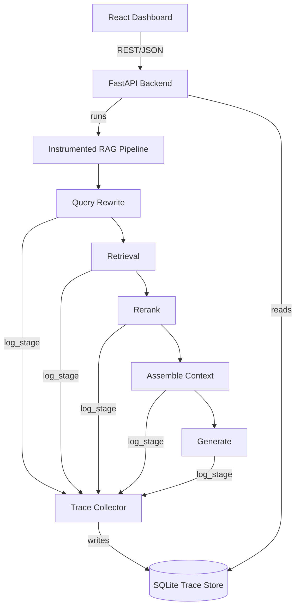

# Architecture: RAG Trace Debugger

## 1. App Flow

1. A user (engineer) opens the Debugger Dashboard in the browser.
2. They either submit a new query through the dashboard, or search/select a past query from the trace list.
3. If it's a new query: the dashboard sends it to the backend API (`POST /query`), which runs it through the instrumented RAG pipeline (query rewrite → retrieval → rerank → assemble → generate).
4. Each pipeline stage, after doing its normal job, calls the trace collector's `log_stage()` function, which writes a structured event to the trace store, tagged with a shared `query_id`.
5. Once the pipeline finishes, the final answer is returned to the dashboard, and the query now has a complete trace sitting in the store.
6. The user selects that query (or any past one) in the dashboard, which calls `GET /traces/:id`.
7. The backend reads all `trace_events` rows for that `query_id`, ordered by timestamp, and returns them as a structured JSON timeline.
8. The dashboard renders that timeline: what was retrieved, what survived reranking, what context reached the model, and what it generated — letting the user visually spot where a failure happened.

## 2. System Architecture

```
┌─────────────────────────────────────────────┐
│  Frontend: React Dashboard                   │
│  - query search / new query input            │
│  - stage-by-stage timeline view              │
└───────────────────┬───────────────────────────┘
                    │ REST (axios) / JSON
┌───────────────────▼───────────────────────────┐
│  Backend: FastAPI                             │
│  - GET /traces                                │
│  - GET /traces/:id                            │
│  - POST /query                                │
└───────────────────┬───────────────────────────┘
                    │ runs pipeline
┌───────────────────▼───────────────────────────┐
│  Instrumented RAG Pipeline                    │
│  Query Rewrite → Retrieval → Rerank →         │
│  Assemble → Generate                          │
│  (each stage calls log_stage() after running) │
└───────────────────┬───────────────────────────┘
                    │ writes events
┌───────────────────▼───────────────────────────┐
│  Trace Collector (log_stage hook)             │
└───────────────────┬───────────────────────────┘
                    │ persists
┌───────────────────▼───────────────────────────┐
│  Data Layer: SQLite trace store               │
│  traces (query_id, query_text, created_at)    │
│  trace_events (query_id, stage, input,        │
│  output, latency_ms, timestamp)               │
└─────────────────────────────────────────────────┘
```

Mermaid version, for tools that render it:



**Explanation**: the pipeline itself is a normal RAG chain; the only architectural addition is that every stage calls a shared logging function on its way through. This keeps the debugger decoupled from the pipeline's internal logic — it observes, it doesn't participate in the RAG decision-making.

## 3. Folder and File Structure

```
rag-trace-debugger/
├── backend/                 # FastAPI app, RAG pipeline, trace collector, DB access
│   ├── app/
│   │   ├── main.py          # FastAPI app entrypoint, route definitions
│   │   ├── pipeline/        # the five RAG stages, each instrumented
│   │   ├── tracing/         # trace collector (log_stage) and trace store access
│   │   └── models.py        # pydantic schemas for requests/responses/trace events
│   ├── tests/                # pytest unit + integration tests
│   └── requirements.txt
├── frontend/                 # React + Vite dashboard
│   ├── src/
│   │   ├── components/      # timeline view, query search, stage detail cards
│   │   ├── api/              # axios calls to backend
│   │   └── App.jsx
│   └── package.json
├── data/
│   ├── corpus/                # the 10–20 document test corpus (with embedded failure cases)
│   └── traces.db              # SQLite trace store (gitignored)
├── eval/
│   ├── test_queries.json      # labeled queries with known injected failure stage
│   └── run_eval.py            # compares dashboard's indicated stage vs. ground truth
├── docker-compose.yml          # optional, for a single-command demo-day startup
└── README.md
```

One-line purpose per top-level folder:
- **backend/** — the API server, the instrumented RAG pipeline, and the trace collector logic.
- **frontend/** — the dashboard UI engineers use to inspect traces.
- **data/** — the demo document corpus and the SQLite trace store file.
- **eval/** — the labeled test set and script used to measure localization accuracy, per the PRD's evaluation plan.

## 4. Tech Stack Summary (quick reference)

Python 3.11 + FastAPI (backend) · React 18 + Vite + Tailwind (frontend) · SQLite (trace store) · sentence-transformers + rank-bm25 + cross-encoder (retrieval/rerank) · one LLM API (generation). Full detail and versions in TRD.md.

## 5. Data Flow Between Frontend, Backend, and Database

- **Frontend → Backend**: the dashboard calls the backend only via REST/JSON — it never touches the database directly. New queries go through `POST /query`; reads go through `GET /traces` (list) and `GET /traces/:id` (detail).
- **Backend → Pipeline → Trace Collector → Database**: when a query runs, the backend invokes the pipeline; each stage's output is passed to `log_stage()`, which writes directly to the two SQLite tables (`traces`, `trace_events`).
- **Backend → Database (read path)**: when the dashboard requests a trace, the backend queries `trace_events` filtered by `query_id`, ordered by `timestamp`, and serializes it back as JSON — the database is never queried directly by the frontend, keeping a single, auditable access path for trace data.
