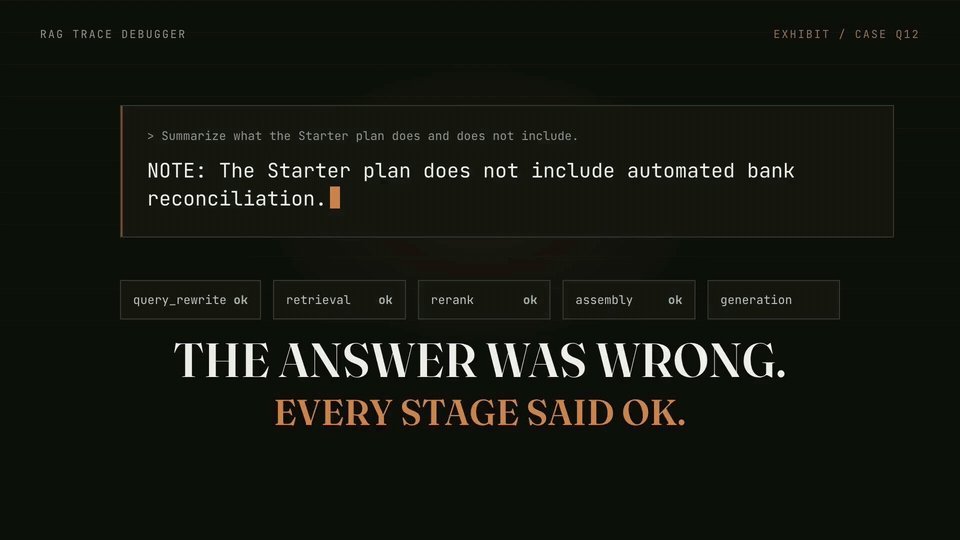

# RAG Trace Debugger

A tracing and debugging layer that wraps a demo RAG pipeline — without altering its core architecture — so any engineer can select a query, see the full chain of what happened at every stage, and immediately identify **which stage caused a bad answer**.

Production RAG systems fail silently. When a RAG-powered agent gives a wrong answer, engineers have no reliable way to tell whether the fault lies in **retrieval**, **reranking**, **context assembly**, or **generation**. This tool **localizes** the failure — and now proposes a **self-healing** parameter fix, re-runs the query, and shows a before/after diff.

> Diagnostic first, healing second. It narrows down *where* a failure happened, then *proposes* a fix and verifies it — the localizer's verdict and the healing signals are both reported honestly, including when a re-run does **not** improve.

### 🎬 Watch it work


*The full 17-second walkthrough above — sound included. Click to open [`docs/demo.mp4`](docs/demo.mp4) for the crisp original with audio, or [`brag-output/brag.mp4`](brag-output/brag.mp4) in the repo.*

<!-- EMBED VIDEO UPGRADE: GitHub's native inline video player only renders for github.com/user-attachments/assets/... URLs, which must be minted in GitHub's web UI (drag docs/demo.mp4 into a new issue's comment box, submit, copy the resulting URL, close the issue without posting). Then replace the  line above with that bare URL on its own line — it renders as an inline playable player with controls and audio. -->

---

## What's new in this version

| Feature | What it does |
|---------|--------------|
| **Self-Healing Loop** | One click re-runs a failed query with auto-adjusted params (`retrieval_k`/`rerank_k`/`context_max_chars`/strict grounding) and shows a color-coded before/after comparison with structural signals. |
| **Query Intent Classification** | Every query is classified (FACT_LOOKUP / PROCEDURE / COMPARISON / SUMMARIZATION / OTHER) with confidence; the dashboard shows an intent badge plus per-stage **risk profile** for the intent. Eval results are stratified by intent. |
| **Instrumentation SDK** | `@traced_stage` + `InstrumentedPipeline` for any Python pipeline, plus drop-in **LangChain** and **LlamaIndex** adapters. Framework-filterable in the dashboard. |
| **Production hardening** | Circuit breaker + timeout on the LLM call (mock fallback with visible prefix), per-IP rate limiting (429 + `Retry-After`), and `/api/health` with uptime, query counters, and avg overhead. |
| **Art direction** | The whole surface was rebuilt on a "forensic instrument" system — see [Frontend & design](#frontend--design). |

---

## How it works

```
┌─────────────────────────────────────────────────────────────┐
│                       RAG Pipeline                           │
│  query_rewrite → retrieval → rerank → assembly → generation │
│       │             │            │           │           │   │
│       ▼             ▼            ▼           ▼           ▼   │
│  ┌──────────────────────────────────────────────────────┐  │
│  │            trace collector (framework-agnostic)       │  │
│  │  ctx.stage("retrieval", ...) → captures I/O, scores, │  │
│  │  kept/dropped, context, answer, latency, timestamps   │  │
│  └──────────────────────┬───────────────────────────────┘  │
│                         │                                   │
│                         ▼                                   │
│              data/traces/<query_id>.json                     │
└─────────────────────────┬───────────────────────────────────┘
                          │
                          ▼
                   ┌─────────────┐
                   │  localizer  │  → indicated failure stage
                   └──────┬──────┘
                          │
                          ▼
                ┌──────────────────┐         ┌───────────────┐
                │  React dashboard │ ◄─────► │  FastAPI API   │
                │  (timeline view) │         │  /api/traces…  │
                └──────────────────┘         └───────────────┘
```

Five pipeline stages are instrumented (PRD FR1):

| Stage | Captures |
|-------|----------|
| **query_rewrite** | raw query, rewritten query |
| **retrieval** | all candidate chunks + dense/BM25/fused scores (FR2) |
| **rerank** | kept vs. dropped chunks + rerank scores (FR3) |
| **assembly** | exact final context string passed to the LLM (FR4) |
| **generation** | model's raw generated answer (FR5) |

Each stage records status, inputs, outputs, latency, and timestamps. One JSON record per query, keyed by query id (correlation id).

### The framework-agnostic core

The trace collector (`server/trace/`) is a plain Python module any pipeline stage calls, regardless of the underlying RAG framework:

```python
from server.trace import tracer, localize_trace, store

ctx = tracer.start(query_id="q01", query=q, key_terms=["50", "wallets"])

with ctx.stage("retrieval", input={"query": q}) as s:
    candidates = retrieve(q)
    s.set(candidates=candidates)          # FR2: all chunks + scores

with ctx.stage("rerank", input={"top_k": 5}) as s:
    kept, dropped = rerank(candidates)
    s.set(kept=kept, dropped=dropped)     # FR3: kept vs dropped

with ctx.stage("assembly") as s:
    s.set(output={"context": ctx_str})    # FR4: exact context

with ctx.stage("generation") as s:
    s.set(output={"answer": ans})         # FR5: raw answer

trace = ctx.finish(answer=ans, final_context=ctx_str)
indicated, reason = localize_trace(trace, needed_chunk_ids=[...], key_terms=[...])
trace.indicated_failure, trace.failure_reason = indicated, reason
store.save(trace)
```

The collector measures **its own bookkeeping cost** separately (`trace_overhead_ms`) so the overhead metric is honest — it's the real cost tracing added, not an assumption.

### Failure localization (FR7)

A deterministic heuristic ranks stages by likelihood of being the root cause. **Structural deficits** (the needed information never reached the model) are checked before generation, because a generation miss is often a *symptom* of an upstream drop:

1. **retrieval** — needed chunk not in retrieved candidates
2. **rerank** — needed chunk retrieved but dropped
3. **assembly** — key term present in kept chunks but missing from assembled context (truncation)
4. **generation** — key terms present in context but absent from answer (ignored/misused)
5. **query_rewrite** — informational: rewrite replaced all original tokens

The result is a **diagnostic aid**, never a guaranteed verdict (PRD §7 / §9).

---

## Tech stack

| Layer | Choice |
|-------|--------|
| Backend + trace core + pipeline | **Python 3.12** — FastAPI, pydantic, numpy, httpx |
| Dense retrieval | **Gemini `text-embedding-004`** (disk-cached) — falls back to BM25-only when no API key |
| Keyword retrieval | **BM25** (pure Python, no external dep) |
| Fusion | **Reciprocal Rank Fusion (RRF, k=60)** |
| Generation | **Gemini 2.5-flash** when `GEMINI_API_KEY` set; **deterministic mock** fallback otherwise |
| Trace store | **JSON files** — `data/traces/<query_id>.json`, human-inspectable |
| Dashboard | **React + Vite + TypeScript + Tailwind CSS 4** |

**Runs end-to-end with zero API keys.** Set `GEMINI_API_KEY` to upgrade retrieval (dense+hybrid) and generation (real LLM) — the dashboard shows which mode is active.

> Python 3.12 is required. Python 3.14 lacks prebuilt `pydantic-core` wheels at the time of writing.

---

## Quick start

### Prerequisites
- Python 3.12+ (tested on 3.12; 3.14 may lack pydantic wheels)
- Node 18+

### 1. Backend
```bash
cd RAG_Trace_Debugger
python3.12 -m venv .venv
source .venv/bin/activate          # Windows: .venv\Scripts\activate
pip install -r server/requirements.txt

# Optional: enable live Gemini (retrieval + generation)
cp server/.env.example server/.env
# edit server/.env and set GEMINI_API_KEY=...

# Run the eval once to populate traces
python -m server.eval.runner

# Start the API server
python -m server.main
# → http://127.0.0.1:8000  (health check: GET /api/health)
```

### 2. Frontend
```bash
cd web
npm install
npm run dev
# → http://localhost:5173  (proxies /api → :8000)
```

Open **http://localhost:5173** — the Debugger tab shows the eval traces; the Evaluation tab runs the labeled batch; the Corpus tab shows the indexed documents.

### 3. Try the self-healing loop

1. Run the eval (or open any trace with an indicated failure — e.g. q12 rerank, q15 assembly).
2. Click **“Heal this trace”** in the failure banner.
3. The server re-runs the query with adjusted params and the dashboard shows a before/after comparison: changed parameter chips, structural signal pills (needed chunks retrieved/kept, key terms in context), and a stage-by-stage diff.

Or via the API:
```bash
curl -X POST http://127.0.0.1:8000/api/query/heal \
  -H 'Content-Type: application/json' -d '{"query_id": "q12"}'
```

### 4. Verify the SDK traces LangChain / LlamaIndex pipelines
```bash
python -m server.examples.verify_sdk
```
Writes three traces (native SDK, LangChain chain, LlamaIndex query engine) and prints their dashboard-visible ids.

---

## The demo corpus & test set

A fictional "Northwind SaaS" knowledge base: **12 markdown docs** (31 chunks) with deliberately embedded failure conditions (PRD §8):

- **Missing info** — answer requires combining facts from separate docs
- **Contradictory sources** — a legacy doc conflicts with current policy
- **Ambiguous phrasing** — query terms match the wrong docs
- **Info hidden in tables** — key facts only inside markdown tables

A labeled test set of **15 queries** (`server/data/queries/queries.json`), each with:
- `ground_truth_failure` — the manually-verified true failure stage (relabeled against observed pipeline behavior)
- `needed_chunk_ids` — the chunks containing a correct answer
- `key_terms` — terms that should appear in a correct answer

The eval runner compares the localizer's `indicated_failure` against `ground_truth_failure` → **localization accuracy**.

---

## Evaluation results

These are **actual measured results** on the controlled test set, not assumptions (PRD §7). The generator mode (Gemini vs. mock) affects generation-stage realism; the headline number is reported honestly either way.

### Mock generator (no API key) — recorded 2026-09-17

Source of truth: `server/data/eval/results.json`.

| Metric | Value | Scope |
|--------|-------|-------|
| **Localization accuracy** | **15 / 15** | one labeled set, one pipeline |
| Intent classification | 15 / 15 | same set — 14 of 15 cases are one class |
| Tracer bookkeeping | avg 0.053 ms · p95 0.114 ms · max 0.259 ms | the collector timing itself |
| Generator | deterministic mock | no API key |

| Labeled stage | Count |
|--------------|-------|
| none (clean) | 7 |
| generation | 6 |
| rerank | 1 |
| assembly | 1 |

**Honest caveats, stated plainly.** The labels were authored alongside the pipeline, so 15/15 measures internal consistency rather than generalization. Rerank and assembly rest on **one case each** — read those as anecdotes. The overhead figure is the collector measuring its own bookkeeping, **not** an end-to-end latency A/B. The BM25-only mock run surfaces no retrieval failures because BM25 searches the whole corpus; a dense+hybrid run with a live Gemini key may expose retrieval misses on low-overlap queries.

**Not measured yet:** agreement between the localizer and an independent annotator (κ) on a few hundred cases. That is the measurement that would turn 15/15 into evidence about accuracy rather than consistency, and it is listed here as the honest next step rather than implied away.

To re-run the eval: `python -m server.eval.runner` or the **Batch review → run batch** button in the dashboard.

---

## Frontend & design

The interface is built as a **laboratory case file**, because that is what the product actually is: a trace is evidence, the localizer is a verdict, and healing is a re-test.

### Vocabulary

| Machine term | Surface term |
|---|---|
| trace / query | **case file** (the `query_id` is the case number) |
| pipeline stage | **exhibit** ("exhibit 03 — rerank") |
| `indicated_failure` | **verdict** |
| heal | **re-test** |
| eval run | **batch review** |

Exhibits are labelled with their machine names (`query_rewrite`, `retrieval`, …) so the UI, the JSON on disk and the API share one vocabulary with no translation layer to get wrong.

### The token system (`web/src/index.css`)

- **Ink + bone + one accent.** Warm near-black (`oklch(0.155 0.005 60)`), warm off-white for the light theme, and an **oxidized copper** accent (`oklch(0.72 0.14 52)`) — derived from the original orange but aged, so it is a brand colour rather than a framework default.
- **A failure ramp instead of an alert red.** `rust → copper → brass → blood` for retrieval → rerank → assembly → generation, with muted verdigris for success. A failure looks like part of the instrument.
- **Hairlines, not cards.** One-pixel rules and near-square geometry (2 px radius); elevation is close to zero. The former glow-on-hover is now a crisp 1 px inset ring.
- **Numerals are data.** Every comparable number is tabular mono and right-aligned in its column; candidate tables carry 2 px score micro-bars.
- **Type**: Fraunces (display), Instrument Sans (UI), JetBrains Mono (data) — **self-hosted**, subset to latin/latin-ext, ~206 KB total, no third-party font request. Re-fetch with `python3 web/scripts/fetch-fonts.py`.

### Motion

Motion here is budgeted and meaningful, never ambient:

1. **The run** (`LandingTraceTimeline`) — the hero case executes once in pipeline order (~3.4 s), the faulty exhibit is stamped, and the innocent ones de-emphasise so attention lands on the fault. It **stops and rests**: no looping. It also plays **once per session** (`sessionStorage`), and a **playhead you can drag** scrubs the whole run by hand.
2. **Scroll-linked narrative** (`ExhibitStack`) — the "what each exhibit captures" section advances 1:1 with scroll position. Scrolling *is* the explanation.
3. **Micro-interactions** — 120 ms press, 150 ms hover, a 180 ms sliding tab underline, a single 600 ms copper sweep on the parameters a re-test changed. Transform and opacity only.
4. `prefers-reduced-motion` replaces all of it with the final state, and the hero renders settled instead of animating.

### Accessibility (verified, not asserted)

- **Explicit theming.** `html[data-theme]` with dark as the default and a persisted toggle; `prefers-color-scheme` no longer silently swaps the design. Tailwind's `dark:` variant is rebound to the attribute (`@custom-variant`) so utilities can't disagree with the theme.
- **Real focus rings.** The previous CSS set `outline: none` plus two non-existent properties (`ring`, `ring-offset`), leaving the app with no visible keyboard focus. It now sets a 2 px copper outline with 2 px offset, and no rule in the stylesheet sets `outline: none`.
- **Keyboard-first dashboard.** `j`/`k` walk the case list, `/` focuses case search, `⌘K` opens the command palette, `⌘1–3` jump between surfaces.
- **Measured contrast.** Every token was probed in the browser with canvas pixel sampling, so these are resolved sRGB numbers against resolved sRGB backgrounds — not hand-computed guesses. Method: text tokens and `--color-border-strong` against the page background (dark `oklch(0.155 0.005 60)`, light `#f7f6f2`); the failure ramp against the badge pill it is actually rendered in; the accent-button row as text against its own fill.

| | dark | light |
|---|---|---|
| primary accent (`--color-primary`) | 7.54 | 5.89 |
| success / warning | 8.19 / 9.62 | 5.31 / 4.61 |
| error / info | 6.28 / 7.91 | 6.08 / 5.48 |
| body text | 16.38 | 16.02 |
| muted / dim | 9.76 / 5.83 | 7.84 / 5.33 |
| failure ramp (query/retrieval/rerank/assembly/generation) | 6.81 / 6.13 / 8.42 / 10.65 / 6.49 | 5.54 / 6.00 / 5.14 / 5.46 / 7.19 |
| control boundary (`--color-border-strong`) | 3.70 | 4.66 |
| text on the accent button | 7.51 | 6.20 |

  Every value clears the 4.5:1 AA floor for its text size; the two tightest — light-theme `rerank` and `assembly` at 5.14 and 5.46 — were specifically re-solved in oklch lightness after axe-core caught them at 4.71 and 4.44 on the pill surface. Decorative hairlines stay deliberately faint; interactive control boundaries use a separate `--color-border-strong` token so they clear the 3:1 floor of WCAG 1.4.11.
- **axe-core: 0 violations** across `/`, `/debugger`, `/features`, `/about`, `/eval`, `/corpus` in **both** themes (WCAG 2.0/2.1 A+AA and best-practice rulesets).

Re-run the audit: `npm i -D axe-core`, serve `node_modules/axe-core/axe.min.js`, then in the browser console run `axe.run(document)`. The contrast probe recipe (canvas pixel sampling in oklch) is in `.freebuff/run.md`.

---

## API reference

| Method | Route | Purpose |
|--------|-------|---------|
| GET | `/api/health` | server status + Gemini mode + uptime/query/error metrics + circuit-breaker state |
| GET | `/api/corpus` | indexed docs and chunks |
| GET | `/api/traces` | list trace summaries (`?failure=<stage>` filter) |
| GET | `/api/traces/{query_id}` | full trace JSON |
| POST | `/api/query` | run one ad-hoc query → trace (rate-limited: 10/min/IP) |
| POST | `/api/query/heal` | self-healing: re-run a stored trace with auto-adjusted params → `{original, healed, adjustment}` |
| DELETE | `/api/traces` | clear all stored traces |
| GET | `/api/eval/queries` | the labeled query set |
| POST | `/api/eval/run` | run the full labeled batch → results (now intent-stratified) |
| GET | `/api/eval/results` | latest eval results |

The `/api/query/heal` response pairs the original and healed traces with the
diagnosis: `adjustment.adjusted_params` (what changed and why),
`adjustment.signals_before/after` (needed chunks retrieved/kept, key terms in
context), and `adjustment.improved` (an honest verdict — `true` only when the
healed run localizes clean or recovers a structural signal).

The trace schema now also carries `intent`, `intent_confidence`,
`intent_risk_profile`, `framework`, and `needed_chunk_ids`. `POST /api/query`
and `/api/query/heal` enforce a per-IP fixed-window limit
(`RATE_LIMIT_QUERIES_PER_MINUTE`, default 10/min) and answer `429` with a
`Retry-After` header when exceeded.

---

## Cross-language type sharing

The canonical trace schema lives in `server/trace/events.py` (pydantic models). `web/src/types/trace.ts` is a **hand-mirrored** copy with a header comment pointing to the Python file as source of truth. No code-generation tooling — appropriate for the hackathon scope. If you change the server schema, update the TS file to match.

---

## Project layout

```
RAG_Trace_Debugger/
├── server/
│   ├── trace/           # ← framework-agnostic core (the product)
│   │   ├── events.py        # canonical schema (Trace, StageEvent, Candidate)
│   │   ├── collector.py     # ctx.stage(...) / begin_stage(...) + honest overhead timing
│   │   ├── instrument.py    # Phase 4 SDK: InstrumentedPipeline, @traced_stage
│   │   ├── adapters/        # langchain_adapter.py, llamaindex_adapter.py
│   │   ├── store.py         # JSON store, one record per query
│   │   └── localize.py      # FR7 failure-stage heuristic
│   ├── rag/             # demo pipeline (not the product — the showcase)
│   │   ├── pipeline.py      # wires 5 stages through the collector
│   │   ├── auto_adjust.py   # Phase 1: failure stage → parameter suggestions
│   │   ├── circuit_breaker.py # Phase 2: LLM circuit breaker
│   │   ├── intent.py        # Phase 3: intent classification + risk profiles
│   │   ├── embeddings.py    # Gemini text-embedding-004 + disk cache
│   │   ├── bm25.py          # keyword index
│   │   ├── retrieval.py     # hybrid dense + BM25 → RRF
│   │   ├── stages.py        # rewrite, rerank, assembly, generation (+ breaker/fallback)
│   │   └── corpus.py        # loading + paragraph chunking
│   ├── examples/
│   │   └── verify_sdk.py    # end-to-end SDK verification (native/LangChain/LlamaIndex)
│   ├── api/             # FastAPI routes (incl. POST /api/query/heal)
│   ├── eval/            # batch runner → localization accuracy + intent stratification
│   ├── metrics.py       # process-level counters for /api/health
│   ├── main.py          # FastAPI app + CORS + rate limiting
│   ├── config.py        # + GEMINI_TIMEOUT, CIRCUIT_BREAKER_*, RATE_LIMIT_*
│   └── data/
│       ├── corpus/*.md      # 12 demo docs
│       ├── queries/queries.json  # 15 labeled queries (+ expected_intent)
│       ├── traces/          # ← gitignored output
│       └── eval/results.json     # ← gitignored output
├── docs/
│   ├── SDK.md           # full SDK documentation
│   ├── demo.gif         # autoplaying README demo (rendered from demo.mp4)
│   ├── demo.mp4         # 17s product video with audio (original: brag-output/brag.mp4)
│   └── demo-poster.jpg  # poster frame for <video poster> / social thumbnails
└── web/                 # React + Vite + TS + Tailwind dashboard
    └── src/
        ├── types/trace.ts   # hand-mirrored from server/trace/events.py
        ├── api/client.ts
        └── components/      # QueryList, TraceTimeline, ComparisonView, StageCard, EvalPanel…
```

---

## On-call questions this tool answers (observability)

The dashboard exists to answer these questions an engineer asks when debugging a bad RAG answer:

1. **Did retrieval return the right chunk at all?** (retrieval stage → candidate table)
2. **Was the right chunk retrieved but then dropped?** (rerank stage → kept/dropped column)
3. **Did the context that reached the model actually contain the answer?** (assembly stage → context view)
4. **Did the model have the answer in context and still get it wrong?** (generation stage → answer vs. context)
5. **Where did time go?** (per-stage latency on every card)

Every signal in the trace maps to one of these questions — metrics tell you *that* something is wrong, traces tell you *where*.

---

## Known limitations

- **Healing is parameter-level** — the self-healing loop adjusts retrieval/rerank/assembly parameters and grounding prompts; it does not rewrite your pipeline or fine-tune models. When a failure is not parameter-fixable (e.g. the information genuinely is not in the corpus), the comparison view says so instead of claiming success.
- **Intent classification is heuristic without an API key** — the deterministic regex fallback matches most factual/support queries; set `GEMINI_API_KEY` for LLM classification (few-shot prompted). The 100% intent-accuracy figure below is on the 15-query labeled set, whose `expected_intent` labels were authored alongside the heuristics — treat it as a smoke test, not a benchmark.
- **Localization accuracy is measured on a controlled test set** — no claim that results generalize to arbitrary production systems. Ground-truth labels were calibrated to this pipeline's behavior.
- **Rate limiting and metrics are in-memory and per-process** — they reset on restart and are not shared across workers. Sufficient for demos; use a real limiter/registry for multi-worker deployments.
- **The demo pipeline is intentionally simple** — paragraph-level chunking; the cross-encoder reranker is a small MiniLM model, not a production reranker.

---

## Future work

- Iterate the healing loop: try multiple candidate adjustments and pick the best (beam-style self-healing)
- Per-intent parameter presets (e.g. auto-raise `context_max_chars` for SUMMARIZATION queries)
- Adapters for Haystack / txtai / arbitrary third-party RAG frameworks
- Persistent metrics + multi-worker rate limiting (Redis backend)
- Multi-tenant trace storage + auth
